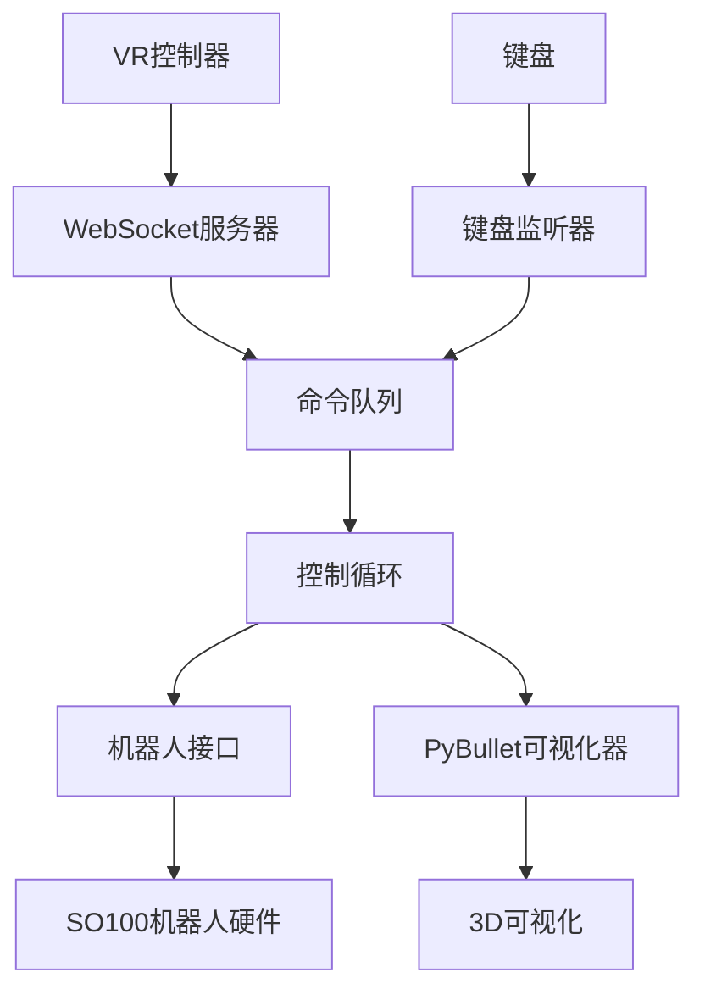

test

# telegrip - SO100 机械臂遥操作系统

这是一个面向 [SO100 机械臂](https://github.com/TheRobotStudio/SO-ARM100) 的开源遥操作控制系统，支持通过 VR 控制器或键盘输入进行控制，并集成了共享逆/正运动学、3D 可视化和 Web UI。


*通过 Meta Quest 这类 VR 头显以及内置的 WebXR 应用，控制器运动会被实时传输到 telegrip 控制器中，这样你无需专门的 leader arm 就可以记录训练数据。*

https://github.com/user-attachments/assets/e21168b5-e9b4-4c83-ab4d-a15cb470d11b

*使用 Quest 3 头显对两台 SO-100 机械臂进行 telegrip 遥操作*

## 功能特性

- **统一架构**：使用单一入口协调所有组件
- **多种输入方式**：支持 VR 控制器（Quest/WebXR）和键盘控制
- **共享 IK/FK 逻辑**：基于 PyBullet 为双臂提供逆运动学和正运动学
- **实时可视化**：使用 PyBullet 进行 3D 可视化，带坐标系和标记
- **安全机制**：关节限位裁剪、优雅关闭、错误处理
- **异步/非阻塞**：所有组件并发运行，互不阻塞

## 安装

### 前置条件

1. **机器人硬件**：一台或两台带 USB 串口连接的 SO100 机械臂
2. **Python 环境**：Python 3.8+，并安装所需依赖
3. **VR 设备**（可选）：Meta Quest 或其他支持 WebXR 的头显设备（无需安装额外 App）

### 安装包

你必须先按照官方说明手动安装 LeRobot：[https://github.com/huggingface/lerobot](https://github.com/huggingface/lerobot)

按照 LeRobot 官方安装指南执行：

```bash
# 克隆官方 LeRobot 仓库
git clone https://github.com/huggingface/lerobot.git
cd lerobot
# 按官方说明安装（通常是）：
pip install -e .
```

安装好 LeRobot 后，再安装 telegrip（当前这个包）：

```bash
# 以可编辑模式安装（推荐用于开发）
git clone https://github.com/DipFlip/telegrip.git
pip install -e .
```

如果系统中不存在自签名 SSL 证书，会自动创建 `cert.pem` 和 `key.pem`。

如果你因为某些原因需要手动生成，可以执行：

```bash
openssl req -x509 -newkey rsa:2048 -keyout key.pem -out cert.pem -sha256 -days 365 -nodes -subj "/C=US/ST=Test/L=Test/O=Test/OU=Test/CN=localhost"
```

## 使用方法

### 基本使用

运行完整遥操作系统：

```bash
telegrip
```

第一次运行时，你可能会被要求完成姿态标定，参考这个指南：  
[LeRobot 标定说明](https://github.com/huggingface/lerobot/blob/8cfab3882480bdde38e42d93a9752de5ed42cae2/examples/10_use_so100.md#e-calibrate)

标定文件会保存在 `.cache/calibration/so100/arm_name.json`。  
当系统检测到标定文件后，你会看到类似下面的提示：

```bash
🤖 telegrip starting...
Open the UI in your browser on:
https://192.168.7.233:8443
Then go to the same address on your VR headset browser
```

点击或在浏览器中输入该地址即可打开 UI。  
然后在 VR 头显浏览器中访问相同地址进入 VR Web 应用。

第一次使用时，你需要在设置菜单（右上角）中填写机械臂串口信息。  
你也可以直接在仓库根目录的 `config.yaml` 中手动填写。

当界面显示已找到机械臂（绿色指示）后，点击 `"Connect Robot"`，就可以开始通过键盘或 VR 头显进行控制。

### 命令行选项

```bash
telegrip [OPTIONS]

Options:
  --no-robot        禁用真实机器人连接（仅可视化）
  --no-sim          禁用 PyBullet 仿真和逆运动学
  --no-viz          禁用 PyBullet 可视化（无界面模式）
  --no-vr           禁用 VR WebSocket 服务
  --no-keyboard     禁用键盘输入
  --autoconnect     启动时自动连接机器人电机
  --log-level LEVEL 设置日志级别：debug、info、warning、error、critical（默认：warning）
  --https-port PORT HTTPS 服务端口（默认：8443）
  --ws-port PORT    WebSocket 服务端口（默认：8442）
  --host HOST       主机 IP 地址（默认：0.0.0.0）
  --urdf PATH       机器人 URDF 文件路径
  --left-port PORT  左臂串口（默认：/dev/ttySO100red）
  --right-port PORT 右臂串口（默认：/dev/ttySO100leader）
```

### 开发/测试模式

**仅可视化**（不连接真实机器人）：

```bash
telegrip --no-robot
```

**仅键盘控制**（禁用 VR）：

```bash
telegrip --no-vr
```

**无仿真**（禁用 PyBullet 和 IK）：

```bash
telegrip --no-sim
```

**无界面模式**（不打开 PyBullet GUI）：

```bash
telegrip --no-viz
```

**自动连接机器人**（跳过手动连接步骤）：

```bash
telegrip --autoconnect
```

## 控制方式

### VR 控制器控制

1. **准备**：将 Meta Quest 连接到同一网络，并访问 `https://<你的IP>:8443`

2. **机械臂位置控制**：
   - **按住 grip 按钮** 激活对应机械臂的位置控制
   - 按住 grip 时，机械臂夹爪末端会在 3D 空间中跟随控制器位置移动
   - 松开 grip 按钮后停止位置控制

3. **手腕姿态控制**：
   - 控制器的 **roll 和 pitch** 会映射到机械臂的腕部关节
   - 这样可以精确控制末端执行器朝向

4. **夹爪控制**：
   - 按住 **trigger 扳机键** 关闭夹爪
   - 只要持续按住，夹爪就保持闭合
   - 松开 trigger 后夹爪张开

5. **独立控制**：
   - 左右控制器分别独立控制左右机械臂
   - 你可以同时操作两只手，也可以只操作其中一只

### 键盘控制

**左臂控制**：

- **W/S**：前进 / 后退
- **A/D**：左移 / 右移
- **Q/E**：下降 / 上升
- **Z/X**：腕部滚转
- **F**：切换夹爪开 / 合

**右臂控制**：

- **I/K**：前进 / 后退
- **J/L**：左移 / 右移
- **U/O**：上升 / 下降
- **N/M**：腕部滚转
- **;（分号）**：切换夹爪开 / 合

## 系统架构

### 组件通信关系



### 控制流程

1. **输入提供器**（VR/键盘）生成 `ControlGoal` 消息
2. **命令队列** 缓冲这些控制目标，等待处理
3. **控制循环** 消费目标并执行：
   - 将位置目标转换为 IK 解
   - 更新机械臂关节角度，并进行安全裁剪
   - 向机器人硬件发送命令
   - 更新 3D 可视化
4. **机器人接口** 负责硬件通信和安全控制

### 数据结构

**ControlGoal**：高级控制命令

```python
@dataclass
class ControlGoal:
    arm: Literal["left", "right"]           # 目标机械臂
    mode: ControlMode                       # POSITION_CONTROL 或 IDLE
    target_position: Optional[np.ndarray]   # 3D 位置（机器人坐标系）
    wrist_roll_deg: Optional[float]         # 腕部滚转角
    gripper_closed: Optional[bool]          # 夹爪状态
    metadata: Optional[Dict]                # 附加数据
```

## 配置说明

### 机器人配置

- **关节名称**：`["shoulder_pan", "shoulder_lift", "elbow_flex", "wrist_flex", "wrist_roll", "gripper"]`
- **IK 关节**：前 3 个关节用于位置控制
- **直接控制**：腕部滚转和夹爪采用直接控制
- **安全机制**：从 URDF 读取关节限位并强制执行

### 网络配置

- **HTTPS 端口**：8443（Web 界面）
- **WebSocket 端口**：8442（VR 控制器）
- **主机地址**：0.0.0.0（监听所有网卡）

### 坐标系

- **VR 坐标系**：X=右，Y=上，Z=后（朝向用户）
- **机器人坐标系**：X=前，Y=左，Z=上
- **坐标变换**：由运动学模块自动处理

## 故障排查

### 常见问题

**机器人连接失败**：

- 检查 USB 串口设备权限：`sudo chmod 666 /dev/ttySO100*`
- 确认端口名称与实际设备一致
- 测试时可先运行 `--no-robot`

**VR 控制器无法连接**：

- 确保 Quest 和机器人主机处于同一网络
- SSL 证书会自动生成，但如果问题持续，请检查 `cert.pem` 和 `key.pem` 是否存在
- 先尝试在普通浏览器中直接访问 Web 界面
- 如果缺少 OpenSSL，请安装：`sudo apt-get install openssl`（Ubuntu）或 `brew install openssl`（macOS）

**PyBullet 可视化问题**：

- 安装 PyBullet：`pip install pybullet`
- 尝试无界面模式：`--no-viz`
- 检查指定路径下的 URDF 文件是否存在

**键盘输入无效**：

- 以合适权限运行程序，以确保有输入访问权限
- 检查终端是否处于焦点状态，能够接收按键事件
- 尝试使用 `--no-keyboard` 来隔离问题

### 调试模式

**详细日志**：

```bash
telegrip --log-level info    # 显示详细启动与运行信息
telegrip --log-level debug   # 显示最高详细度调试信息
```

**组件隔离调试**：

- 使用各种禁用参数单独测试某个组件
- 查看日志中的组件状态
- 验证队列通信是否正常

## 开发说明

### 添加新的输入方式

1. 创建一个继承自 `BaseInputProvider` 的新输入提供器
2. 实现 `start()`、`stop()` 和命令生成逻辑
3. 将其加入 `TelegripSystem` 初始化流程
4. 通过命令行参数进行配置

### 扩展机器人接口

1. 向 `RobotInterface` 添加新方法
2. 如果需要，更新 `ControlGoal` 数据结构
3. 修改控制循环执行逻辑
4. 先使用 `--no-robot` 模式进行测试

### 自定义可视化

1. 扩展 `PyBulletVisualizer` 类
2. 添加新的标记类型或坐标系显示
3. 更新控制循环中的可视化调用

## 安全说明

- **急停**：按 `Ctrl+C` 可优雅关闭程序
- **关节限位**：自动根据 URDF 强制执行
- **初始位置**：关闭时机器人会返回安全位置
- **扭矩关闭**：关闭过程中会禁用电机扭矩
- **错误处理**：即使非关键组件失败，系统也会继续运行

## 许可证

本项目采用 MIT License，详情见 `LICENSE` 文件。
