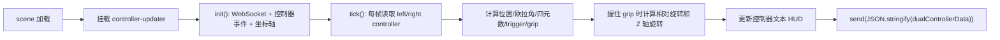

# web-ui 函数调用关系与功能说明

这份文档用于帮助后续阅读 `web-ui` 目录中的前端代码，重点整理：

- 文件职责
- 页面入口与事件入口
- 函数调用关系
- 每个主要函数的用途
- 跨文件依赖关系

适用范围：

- `web-ui/index.html`
- `web-ui/interface.js`
- `web-ui/vr_app.js`
- `web-ui/styles.css`

## 1. 总体结构

`web-ui` 的逻辑可以分成四层：

1. 页面结构层：`index.html`
2. 桌面端 UI 与状态管理：`interface.js`
3. VR 启动与辅助 UI：`vr_app.js`
4. VR 控制器实时采样与 WebSocket 发送：`vr_app.js` 中的 `controller-updater` 组件

其中：

- `interface.js` 负责桌面界面、配置弹窗、状态轮询、键盘控制、桌面/VR 视图切换。
- `vr_app.js` 负责 A-Frame 场景初始化、VR 控制器事件、姿态采样、WebSocket 数据上报、VR 启动按钮。
- `index.html` 提供 DOM 结构，并通过 `onclick` 和 `DOMContentLoaded` 把入口连接到全局函数。
- `styles.css` 只负责样式，不参与函数调用关系。

## 2. 文件职责

### `index.html`

作用：

- 定义桌面 UI、设置弹窗、VR 场景、按钮与状态区。
- 引入 `vr_app.js` 和 `interface.js`。
- 通过 `onclick` 直接触发若干全局函数。
- 在页面加载后动态显示当前访问地址，用于 VR 头显访问提示。

### `interface.js`

作用：

- 管理设置弹窗。
- 拉取和保存系统配置。
- 轮询系统状态并更新页面显示。
- 处理机器人连接/断开。
- 处理网页端键盘控制。
- 根据是否支持 XR、是否处于 VR 模式切换桌面界面显示。
- 提供“切换到 VR 视图”和“返回桌面视图”按钮逻辑。

### `vr_app.js`

作用：

- 注册 A-Frame 组件 `controller-updater`。
- 连接 WebSocket，将左右控制器姿态实时发送给后端。
- 监听控制器按钮事件，例如 `triggerdown`、`gripdown`。
- 计算相对旋转与 Z 轴旋转。
- 创建 VR 启动按钮和 VR 说明面板。

### `styles.css`

作用：

- 页面样式。
- 不包含函数逻辑。

## 3. 页面入口与初始化流程

页面加载后的主要入口有三处：

1. `index.html` 加载脚本：
   - 先加载 `vr_app.js`
   - 再加载 `interface.js`

2. `interface.js` 的 `DOMContentLoaded`
   - 初始化桌面 UI
   - 启动状态轮询
   - 绑定设置表单和弹窗关闭行为
   - 监听窗口大小、全屏状态和 XR 会话变化

3. `vr_app.js` 的 `DOMContentLoaded`
   - 查找 A-Frame 场景
   - 给场景挂载 `controller-updater`
   - 创建 VR 启动按钮

## 4. 总调用关系图

```mermaid
flowchart TD
  A["index.html 页面加载"] --> B["interface.js DOMContentLoaded"]
  A --> C["vr_app.js DOMContentLoaded"]
  A --> D["index.html 内联 DOMContentLoaded"]

  D --> D1["更新 vrServerUrl 文本"]

  B --> B1["updateUIForDevice()"]
  B --> B2["updateStatus()"]
  B --> B3["setInterval(updateStatus, 2000)"]
  B --> B4["fullscreenchange -> updateUIForDevice()"]
  B --> B5["XR sessionstart/sessionend -> updateStatus() + updateUIForDevice()"]
  B --> B6["settingsForm submit -> saveConfiguration()"]
  B --> B7["settingsModal click outside -> closeSettings()"]

  C --> C1["scene loaded -> 挂载 controller-updater 组件"]
  C --> C2["addControllerTrackingButton()"]

  E["onclick: openSettings()"] --> E1["loadConfiguration()"] --> E2["populateSettingsForm(config)"]
  F["onclick: closeSettings()"] --> F1["关闭设置弹窗"]
  G["onclick: restartSystem()"] --> G1["POST /api/restart"] --> G2["closeSettings()"]
  H["onclick: toggleRobotEngagement()"] --> H1["POST /api/robot"] --> H2["updateEngagementUI()"]
  I["onclick: toggleKeyboardControl()"] --> I1["POST /api/keyboard"]
  J["keydown"] --> J1["handleKeyDown(event)"]
  K["keyup"] --> K1["handleKeyUp(event)"]
  J1 --> J2["isControlKey()"]
  K1 --> K2["isControlKey()"]
  J1 --> J3["showConnectionWarning()"]
  J1 --> J4["sendKeyCommand(code, 'press')"]
  K1 --> K4["sendKeyCommand(code, 'release')"]

  L["onclick: switchToVrView()"] --> L1["createFallbackVrButton()"]
  L --> L2["showBackToDesktopButton()"]
  L1 --> L3["createVrInstructionsPanel()"]
  M["onclick/backBtn: switchToDesktopView()"] --> M1["hideBackToDesktopButton()"]

  C2 --> N["创建 Start Controller Tracking 按钮"]
  N --> N1["按钮点击 -> /api/status"]
  N1 --> N2["必要时 POST /api/robot connect"]
  N2 --> N3["scene.enterVR(true)"]
  C2 --> N4["createVrInstructionsPanel()"]
  C2 --> N5["showBackToDesktopButton()"]

  O["controller-updater.init()"] --> O1["createAxisIndicators()"]
  O --> O2["定义 reportVRStatus/sendGripRelease/sendTriggerRelease"]
  O --> O3["定义 calculateRelativeRotation/calculateZAxisRotation"]
  O --> O4["绑定 left/right trigger/grip 事件"]
  O --> O5["建立 WebSocket"]

  O4 --> O6["triggerup -> sendTriggerRelease(hand)"]
  O4 --> O7["gripup -> sendGripRelease(hand)"]
  O4 --> O8["gripdown -> 记录初始姿态/四元数"]

  P["controller-updater.tick()"] --> P1["读取左右手 pose"]
  P --> P2["需要时计算相对旋转"]
  P --> P3["更新控制器 HUD"]
  P --> P4["通过 WebSocket 发送双手控制数据"]
```



## 5. VR 数据链路图

这一部分单独看会更清楚：



## 6. `interface.js` 函数说明

### 配置与弹窗

| 函数 | 作用 | 主要调用关系 |
|---|---|---|
| `openSettings()` | 打开设置弹窗并拉取配置 | 调用 `loadConfiguration()` |
| `closeSettings()` | 关闭设置弹窗 | 被按钮点击、弹窗外点击、重启成功后调用 |
| `loadConfiguration()` | 从 `/api/config` 拉取配置 | 成功后调用 `populateSettingsForm(config)` |
| `populateSettingsForm(config)` | 将配置对象回填到表单 | 被 `loadConfiguration()` 调用 |
| `saveConfiguration()` | 读取表单并保存到 `/api/config` | 被设置表单 `submit` 事件调用 |
| `restartSystem()` | 请求后端重启系统并刷新页面 | 成功后调用 `closeSettings()` |

### 状态与连接控制

| 函数 | 作用 | 主要调用关系 |
|---|---|---|
| `updateStatus()` | 从 `/api/status` 轮询系统状态并更新页面 | 页面初始化调用，随后定时调用 |
| `updateEngagementUI()` | 根据机器人是否已连接刷新按钮和提示文案 | 被 `updateStatus()`、`toggleRobotEngagement()` 调用 |
| `showConnectionWarning()` | 用户未连接机器人却按控制键时显示警告动画 | 被 `handleKeyDown()` 调用 |
| `toggleRobotEngagement()` | 在 connect/disconnect 之间切换 | 成功后调用 `updateEngagementUI()` |
| `toggleKeyboardControl()` | 启用或禁用网页端键盘控制 | 由按钮点击触发 |

### 设备模式与页面切换

| 函数 | 作用 | 主要调用关系 |
|---|---|---|
| `isVRMode()` | 粗略判断当前是否处于 VR/全屏模式 | 被 `updateUIForDevice()` 调用 |
| `updateUIForDevice()` | 根据设备能力和当前模式控制桌面界面显示 | 初始化、窗口变化、全屏变化、XR 会话变化时调用 |
| `switchToVrView()` | 隐藏桌面界面并准备进入 VR 视图 | 调用 `createFallbackVrButton()`、`showBackToDesktopButton()` |
| `switchToDesktopView()` | 返回桌面界面 | 调用 `hideBackToDesktopButton()` |
| `showBackToDesktopButton()` | 创建或显示“返回桌面”按钮 | 被 `switchToVrView()` 和 `vr_app.js` 调用 |
| `hideBackToDesktopButton()` | 隐藏“返回桌面”按钮 | 被 `switchToDesktopView()` 调用 |
| `createFallbackVrButton()` | 创建一个兜底版 VR 启动按钮 | 可能调用 `createVrInstructionsPanel()`，按钮点击后进入 VR |

### 键盘控制

| 函数 | 作用 | 主要调用关系 |
|---|---|---|
| `handleKeyDown(event)` | 处理控制键按下 | 调用 `isControlKey()`、`showConnectionWarning()`、`sendKeyCommand()` |
| `handleKeyUp(event)` | 处理控制键释放 | 调用 `isControlKey()`、`sendKeyCommand()` |
| `isControlKey(code)` | 判断按键是否属于机器人控制按键 | 被 `handleKeyDown()`、`handleKeyUp()` 调用 |
| `sendKeyCommand(keyCode, action)` | 将浏览器按键映射为后端键值并发到 `/api/keypress` | 被 `handleKeyDown()`、`handleKeyUp()` 调用 |

## 7. `vr_app.js` 函数说明

### A-Frame 组件：`controller-updater`

这是 VR 控制的核心组件，主要由 `init()`、`createAxisIndicators()` 和 `tick()` 三部分组成。

| 函数/方法 | 作用 | 主要调用关系 |
|---|---|---|
| `init()` | 初始化控制器引用、WebSocket、状态变量、事件监听与辅助函数 | 调用 `createAxisIndicators()`，并绑定控制器按钮事件 |
| `createAxisIndicators()` | 为左右控制器创建 XYZ 调试坐标轴 | 被 `init()` 调用 |
| `tick()` | 每帧读取控制器姿态、更新 HUD、发送双手控制数据 | 每帧自动执行 |

### `init()` 内部定义的辅助函数

这些函数不是文件级全局函数，但在逻辑上非常重要：

| 函数/方法 | 作用 | 主要调用关系 |
|---|---|---|
| `reportVRStatus(connected)` | 尝试上报 VR 连接状态 | 在 WebSocket `onopen`、`onerror`、`onclose` 中使用 |
| `sendGripRelease(hand)` | 发送 grip 松开事件 | 在左右手 `gripup` 中调用 |
| `sendTriggerRelease(hand)` | 发送 trigger 松开事件 | 在左右手 `triggerup` 中调用 |
| `calculateRelativeRotation(currentRotation, initialRotation)` | 计算相对欧拉角变化 | 在 `tick()` 中 grip 按住时调用 |
| `calculateZAxisRotation(currentQuaternion, initialQuaternion)` | 计算围绕控制器前向轴的旋转角 | 在 `tick()` 中 grip 按住时调用 |

### 组件外部函数

| 函数 | 作用 | 主要调用关系 |
|---|---|---|
| `addControllerTrackingButton()` | 检查 XR 支持并创建正式版 VR 启动按钮 | 页面加载后调用 |
| `createVrInstructionsPanel()` | 创建 VR 操作说明面板 | 被 `addControllerTrackingButton()` 和 `createFallbackVrButton()` 间接使用 |

## 8. `index.html` 中的事件入口

`index.html` 通过内联 `onclick` 直接调用全局函数：

| 入口元素 | 调用函数 | 作用 |
|---|---|---|
| 设置按钮 | `openSettings()` | 打开设置弹窗 |
| 弹窗关闭按钮 | `closeSettings()` | 关闭设置弹窗 |
| 重启按钮 | `restartSystem()` | 请求系统重启 |
| 机器人连接按钮 | `toggleRobotEngagement()` | 连接或断开机械臂 |
| 切换到 VR 视图按钮 | `switchToVrView()` | 切换到 VR 相关界面 |
| 键盘控制开关 | `toggleKeyboardControl()` | 打开或关闭键盘控制 |

此外还有一个内联 `DOMContentLoaded` 回调：

- 读取 `window.location.origin`
- 更新页面中的 `vrServerUrl`
- 用来提示用户在头显里访问当前地址

## 9. 跨文件依赖

这是理解这套代码时最重要的部分之一。

### `vr_app.js` 依赖 `interface.js`

`vr_app.js` 中会尝试调用这些全局函数：

- `updateStatus`
- `showBackToDesktopButton`

具体用途：

- `reportVRStatus()` 中尝试调用 `updateStatus(...)`
- `addControllerTrackingButton()` 中如果存在 `showBackToDesktopButton()`，就显示返回桌面按钮

### `interface.js` 依赖 `vr_app.js`

`interface.js` 中会尝试调用：

- `createVrInstructionsPanel`

具体用途：

- `createFallbackVrButton()` 中如果该函数存在，就先创建 VR 说明面板

### 结论

这两个文件不是完全独立的，而是通过“全局函数名”进行双向耦合。

这种写法的特点是：

- 接线直接，开发方便
- 不需要模块系统
- 但函数之间的隐式依赖较多，阅读时需要同时看两个文件

## 10. 建议的阅读顺序

如果后面你想快速重新理解这套代码，建议按照下面顺序读：

1. `web-ui/index.html`
   - 先看有哪些 DOM 区域
   - 再看有哪些 `onclick` 和脚本引用

2. `web-ui/interface.js`
   - 先看 `DOMContentLoaded`
   - 再看 `updateStatus()` 和 `toggleRobotEngagement()`
   - 再看键盘控制相关函数
   - 最后看设置弹窗和桌面/VR 切换逻辑

3. `web-ui/vr_app.js`
   - 先看文件底部的 `DOMContentLoaded`
   - 再看 `addControllerTrackingButton()`
   - 然后重点看 `AFRAME.registerComponent('controller-updater', ...)`
   - 最后看 `tick()` 中如何采样和发 WebSocket

## 11. 阅读时最值得关注的核心链路

### 链路 1：桌面状态更新

`DOMContentLoaded`
-> `updateStatus()`
-> `/api/status`
-> 更新连接灯、键盘开关、机器人连接状态
-> `updateEngagementUI()`

### 链路 2：键盘控制

`keydown/keyup`
-> `handleKeyDown()` / `handleKeyUp()`
-> `isControlKey()`
-> `sendKeyCommand()`
-> `/api/keypress`

### 链路 3：进入 VR

`addControllerTrackingButton()`
-> 用户点击开始按钮
-> `/api/status`
-> 必要时 `/api/robot connect`
-> `scene.enterVR(true)`

### 链路 4：VR 控制器数据发送

`controller-updater.init()`
-> 建立 WebSocket
-> 绑定控制器按钮事件
-> `tick()` 每帧读取姿态
-> 计算相对旋转
-> 发送 `dualControllerData`

## 12. 一个值得注意的实现细节

`vr_app.js` 中的 `reportVRStatus(connected)` 会尝试调用：

```js
updateStatus({ vrConnected: connected })
```

但 `interface.js` 中的 `updateStatus()` 实际实现并不接收参数，它总是重新请求：

- `/api/status`

所以当前代码里，VR 状态显示主要仍然依赖后端状态轮询，而不是这个参数直传机制。

这不是致命问题，但属于阅读时值得留意的一个实现细节。

## 13. 最简总结

如果只用一句话概括这套 `web-ui`：

> `index.html` 提供界面骨架，`interface.js` 负责桌面控制台和键盘输入，`vr_app.js` 负责 VR 控制器接入、姿态采样和实时上报。

如果只抓两个最核心的入口：

- 桌面入口看 `interface.js` 的 `DOMContentLoaded`
- VR 入口看 `vr_app.js` 的 `controller-updater` 和 `addControllerTrackingButton()`
