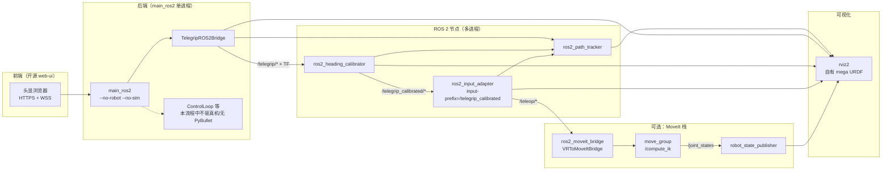
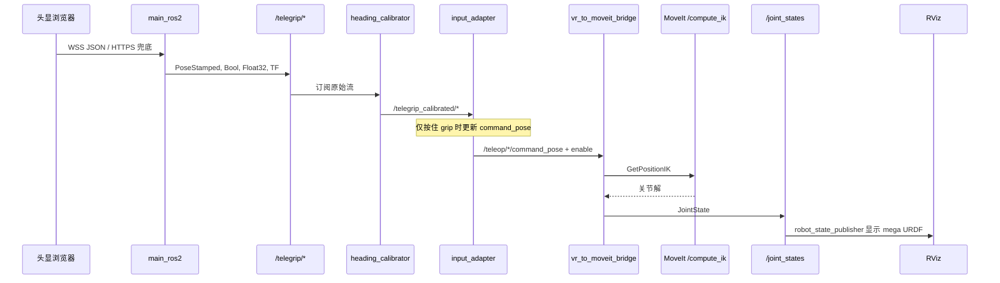

# Telegrip 架构与数据流（本仓库实际用法）

Telegrip 是面向 **VR 遥操作 SO100 机械臂** 的开源项目：浏览器/头显采集手柄位姿，后端解析后既可驱动串口臂 + PyBullet，也可发布到 ROS 2。  
**在本仓库的落地用法中，我们只依赖其前后端与 ROS 桥接**：手柄数据进入 ROS 后，经标定与坐标映射，再接 **MoveIt IK** 与 **自有双臂 URDF**，在 RViz 中验证；真机控制、原版 PyBullet 闭环等能力**未纳入当前工作流**。

**权威启动顺序、命令与调试说明以 [`STARTUP_COMMANDS.md`](./STARTUP_COMMANDS.md) 为准。** 本文从架构角度归纳同一条链路，并标明与上游开源能力的对应关系。

---

## 1. 实际使用的两条链路（与 STARTUP_COMMANDS 一致）

### 1.1 最小链路：仅 ROS + RViz（无机器人网格）

目标：VR 页面 → 原始/标定/teleop 位姿与轨迹 → RViz 可视化。  
**不启动** `mega_robot`、MoveIt、IK 桥接。

典型进程（可分终端或 `start_telegrip_ros2_stack.sh`）：

| 顺序 | 模块 | 作用 |
|------|------|------|
| 1 | `python3 -m telegrip.main_ros2 --no-robot --no-sim` | HTTPS 页面、WSS、**TelegripROS2Bridge** 发布 `/telegrip/*` 与 TF；关闭真机与 PyBullet |
| 2 | `python3 -m telegrip.ros2_heading_calibrator` | 头显航向标定，`/telegrip/*` → `/telegrip_calibrated/*` |
| 3 | `python3 -m telegrip.ros2_input_adapter --input-prefix /telegrip_calibrated` | grip 闩锁逻辑，`/teleop/*/command_pose` 等 |
| 4 | `python3 -m telegrip.ros2_path_tracker` | 多条 `Path` 供轨迹显示 |
| 5 | `start_rviz2_telegrip.sh` | 预置 `Fixed Frame = vr_world`、TF、pose、path |

标定服务（会话级）：`ros2 service call /telegrip_heading_calibrator/calibrate std_srvs/srv/Trigger "{}"`。

### 1.2 完整链路：同上 + 自有 URDF + MoveIt + RViz

在 **1.1 的前 4 步**（或 `--no-rviz` 的一键脚本）之上，再启动 Mega 双臂 MoveIt 栈与 IK 桥接，例如 `start_mega_moveit_teleop.sh` 或 `start_telegrip_mega_demo.sh`（详见 `STARTUP_COMMANDS.md`）。

数据在 ROS 内延伸为：

- `/teleop/{left,right}/command_pose` → **`VRToMoveItBridge`（`ros2_moveit_bridge`）** → 坐标映射与工作空间夹紧 → MoveIt **`/compute_ik`** → **`/joint_states`**
- `robot_state_publisher` + RViz 显示 **`URDF/mega_robot_1st_urdf`** 中的网格与 TF

参数与坐标调试集中在：  
`URDF/mega_robot_1st_moveit_config/config/vr_to_moveit_bridge.yaml`。

---

## 2. 本用法下的主数据流（概览）

虚线表示：进程内仍存在 `ControlLoop` 等上游逻辑，但在 **`--no-robot --no-sim`** 下**不产生真机或仿真控制**；价值集中在 **ROS 发布与后续节点**。

---

## 3. 端到端时序（与 MoveIt 联调时）

---

## 4. 前后端传输（本用法仍依赖的部分）

与开源一致：页面由 **HTTPS**（默认 8443）提供；手柄高频数据走 **WSS**（默认 8442），JSON 含双手/头显位姿、grip、trigger 等。若环境限制 WebSocket，可用 **POST `/api/vr`** 将同结构 JSON 交给同一套 `process_controller_data`（见 `telegrip/main.py`）。

详细 REST 表仍可参考下文「附录」，**日常联调以 `STARTUP_COMMANDS` 中的 URL 与端口为准**。

---

## 5. 各 ROS 节点：输入 / 输出（本链路中的角色）

### 5.1 `TelegripROS2Bridge`（内嵌于 `main_ros2`）

- **输出**：`/telegrip/left|right|headset/pose`，`/telegrip/*/enable`，`/telegrip/*/gripper_input`，TF（`vr_world` → 手柄/头显）。
- **输入**：无订阅；数据来自 VR 包回调 `publish_packet`。

### 5.2 `HeadingCalibrator`（`ros2_heading_calibrator`）

- **订阅**：`/telegrip/...`
- **发布**：`/telegrip_calibrated/...`
- **服务**：`/telegrip_heading_calibrator/calibrate`（`std_srvs/Trigger`）

### 5.3 `TeleopInputAdapter`（`ros2_input_adapter`）

- **订阅**：`--input-prefix`（本用法为 `/telegrip_calibrated`）下的 pose / enable / gripper_input。
- **发布**：`/teleop/*/command_pose`、`/teleop/*/gripper_cmd`（grip 闩锁与相对运动逻辑见 `STARTUP_COMMANDS` 第三节）。

### 5.4 `PosePathTracker`（`ros2_path_tracker`）

- 将多条 `PoseStamped` 累积为 `nav_msgs/Path`，仅用于 RViz 轨迹，不参与 IK。

### 5.5 `VRToMoveItBridge`（`ros2_moveit_bridge`，仅 MoveIt 链路）

- **订阅**：由 YAML 配置，通常包括 `/teleop/*/command_pose` 与 `/telegrip_calibrated/*/enable`。
- **客户端**：`/compute_ik`。
- **发布**：全机 `/joint_states`，以及调试用的 `/mega_moveit/*/target_pose` 等（以参数为准）。

---

## 6. 开源仓库中「当前工作流未使用」的能力（对照）

| 能力 | 说明 |
|------|------|
| `telegrip`（无 `main_ros2`） | 原版入口：HTTPS + WSS + **串口 SO100** + PyBullet，**不发布**本流程依赖的 `/telegrip/*` ROS 话题。 |
| `ControlLoop` + `RobotInterface` | 真机关节控制；`--no-robot` 时不连接机械臂。 |
| PyBullet 可视化与 URDF 内 IK | `--no-sim` 时关闭；自有模型在 **RViz + MoveIt** 侧。 |
| SO100 默认 URDF 路径 | 本用法展示的是 **mega_robot_1st_urdf** 与对应 MoveIt 包。 |

若只关心「VR → ROS → 自有机器人 RViz」，无需运行原版 `telegrip` 可执行文件。

---

## 附录：HTTPS API 摘要（与上游一致）

端口与证书见 `config.yaml`。常用：`GET /api/status`，`POST /api/vr`（HTTPS VR 兜底），`POST /api/robot` 等；完整列表见源码 `telegrip/main.py` 中 `APIHandler`。

---

*架构描述与 [`STARTUP_COMMANDS.md`](./STARTUP_COMMANDS.md) 对齐；若启动方式变更，以该文件与脚本 `start_*.sh` 为准。*
